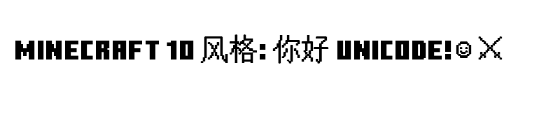

# Minecraft Ten Unicode

一款基于 Minecraft 10 风格的像素字体，支持完整的 Unicode-8 字符集。

## 项目特点
- **Minecraft 10 风格**：核心拉丁字母、数字及基础符号基于经典的 Minecraft 10 字体。
- **全 Unicode 支持**：通过集成 GNU Unifont，支持包括中文、日韩文、特殊符号在内的数万个 Unicode-8 字符。
- **物理加粗优化**：补充的 Unicode-8 字符经过物理字形平移合并处理，使其视觉权重与 Minecraft 10 的厚重风格完美匹配。
- **跨平台兼容**：提供标准 TTF 格式，适用于 Windows, macOS, Linux 以及各类游戏开发环境。

## 文件说明
- `MinecraftTenUnicode.ttf`: 最终生成的字体文件。
- `merge_fonts_v5.py`: 用于生成该字体的 Python 脚本。
- `font_test_final.png`: 字体效果预览图。

## 许可说明
- 本项目生成的字体包含来自 Minecraft 相关社区的资源及 GNU Unifont。
- 引用资源请遵循原作者的许可协议（https://github.com/jia6261/minecraft-ten-unicode/blob/master/LICENSE

## 预览

## 能支持一下我吗
https://space.bilibili.com/3632301950896458

